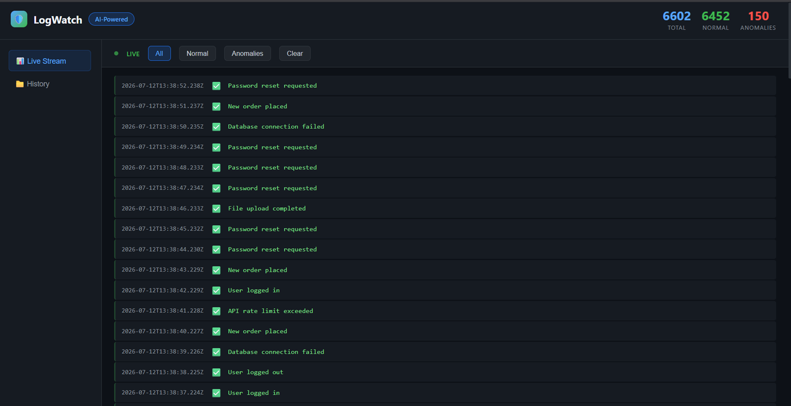
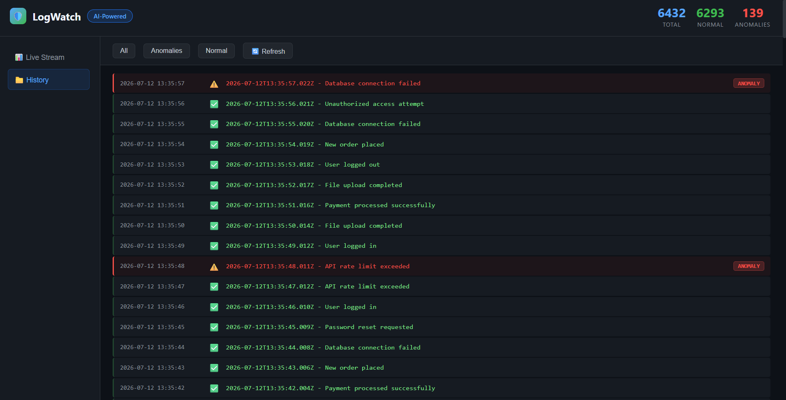

# 🛡️ LogWatch — Real-Time AI Log Anomaly Detection

[](https://github.com/pasupathy188/logwatch/actions)
[](https://waggle-moonwalk-idealness.ngrok-free.dev)


A real‑time log monitoring system that uses AI to automatically detect anomalies in application logs. Features a live dashboard, persistent storage, and automated CI/CD pipeline.

## 🌐 Live Demo
👉 **[LogWatch Dashboard](https://waggle-moonwalk-idealness.ngrok-free.dev)**  
*Temporary ngrok tunnel — you may see a one‑time security notice. Just click "Visit Site".  
A permanent Hugging Face Space will be available on 1 August: `https://pasupathy188-logwatch.hf.space`.*

## 📸 Screenshots
**Live Stream**  


**History Tab**  


## 🎯 Features
- 🔴 **Real‑time Anomaly Detection** – AI engine spots unusual log patterns instantly
- 📊 **Live Dashboard** – Modern dark UI with streaming logs and visual alerts
- 📁 **History Tab** – Query past logs stored in PostgreSQL
- 🐳 **Docker Containerized** – Single container runs all services
- 🔄 **CI/CD Pipeline** – Automated build and deploy via GitHub Actions
- 🧠 **AI‑Powered** – Smart anomaly detection without manual rules
- 📡 **WebSocket Streaming** – Instant log delivery to browser

## 🏗️ Architecture
┌─────────────┐ WebSocket ┌─────────────┐ HTTP ┌─────────────┐
│ Generator │ ──────────────→ │ Backend │ ────────→ │ AI Service │
│ (Node.js) │ │ (Node.js) │ │ (Python) │
└─────────────┘ └──────┬──────┘ └─────────────┘
│
┌─────▼──────┐
│ PostgreSQL │
│ Database │
└────────────┘
│
┌─────▼──────┐
│ Frontend │
│ Dashboard │
└────────────┘

text

## 🛠️ Tech Stack
| Category | Technology |
|----------|------------|
| **Frontend** | HTML5, CSS3, JavaScript |
| **Backend** | Node.js, Express, WebSocket (ws) |
| **AI/ML** | Python, Flask, scikit-learn |
| **Database** | PostgreSQL |
| **Containerization** | Docker, Docker Compose |
| **Process Manager** | Supervisor |
| **CI/CD** | GitHub Actions |
| **Deployment** | Hugging Face Spaces (permanent), ngrok (temporary) |

## 🚀 Quick Start
```bash
git clone https://github.com/pasupathy188/logwatch.git
cd logwatch
docker compose up --build
Open http://localhost:5000

📡 API Endpoints
Endpoint	Method	Description
/api/logs	GET	Get stored logs
/api/logs?type=anomaly	GET	Get anomalies only
/api/stats	GET	Get log statistics
/api/logs	DELETE	Clear all logs
🔮 Future Improvements
Prometheus & Grafana monitoring

Slack/Discord alert integration

Terraform for cloud infrastructure

Advanced ML model (LSTM autoencoder)

Kubernetes deployment

📝 License
MIT License

👤 Author
PASUPATHY RAM P
DevOps | AWS | Docker | AI/ML
---